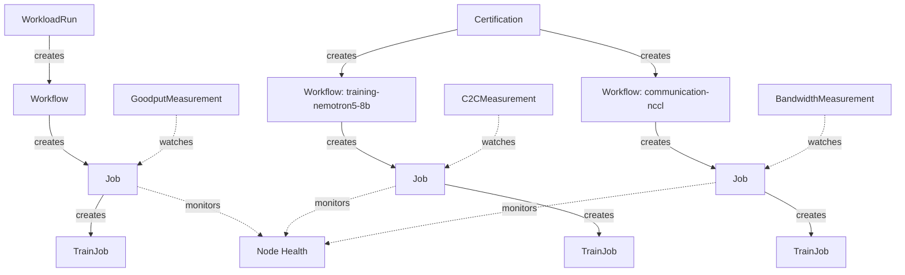
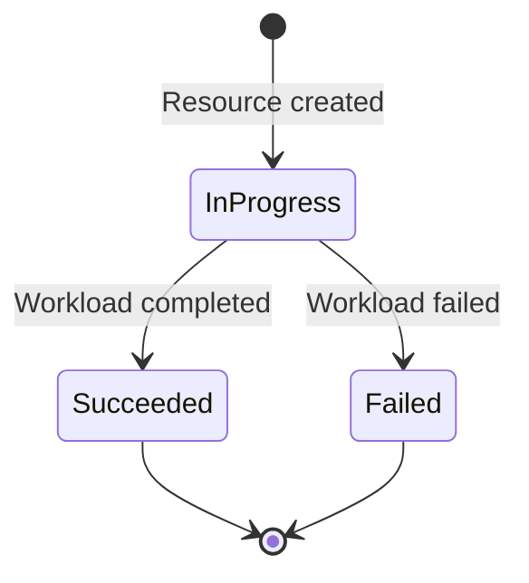

The NVIDIA Cluster Readiness Engine is a Kubebuilder-based Kubernetes controller. A single binary runs seven reconcilers that compose in a three-tier hierarchy modeled after Kubernetes' own Deployment → ReplicaSet → Pod pattern.

## Resource hierarchy

### Certification

The top-level resource. It references a set of `categories` (domain + variant pairs) from the catalog. The controller creates one `Workflow` per category and tracks overall pass/fail status. Failed nodes are recorded per category in ConfigMaps referenced by `status.categoryStatuses[].failedNodesRef`.

### Workflow

Manages a single test run for one category. It pulls the `WorkflowSpec` from the catalog, applies platform and GPU overrides, manages iteration count, and creates the child `Job`. Orchestration targets (which node group runs this workflow) are set at this tier.

### Job

Creates the actual workload (a `TrainJob`) via the adapter pattern. Manages health monitoring via `NodeFailureDetector`, optionally creates a `GoodputMeasurement`, `BandwidthMeasurement`, or `C2CMeasurement` to parse output, and handles checkpoint restart.

### Supporting resources

| Resource | Purpose |
|----------|---------|
| `GoodputMeasurement` | Watches a Job's pod logs via a LogProfile, computes the goodput ratio |
| `BandwidthMeasurement` | Parses NCCL log output, computes per-bus bandwidth metrics |
| `C2CMeasurement` | Parses CPU-GPU coherent-memory bandwidth, latency, and correctness results |
| `LogProfile` | Cluster-scoped; defines regex patterns with named capture groups for log parsing |

## Controller patterns

- **`setExclusiveCondition()`** — enforces mutually exclusive InProgress / Succeeded / Failed conditions at every tier
- **`Owns()` watches** — each tier watches its children for event-driven reconciliation; polling (15s in production, 1s in tests) is a safety net
- **Adapter pattern** — the `Job` controller normalizes `TrainJob` (Kubeflow Trainer v2) to a `WorkloadPhase` via a `WorkloadAdapter` interface (`pkg/workload/ForSpec()`). MPI and PyTorch are framework types at the `WorkloadRun` CLI layer — they generate a `TrainJob` under the hood, not a separate CRD field.

### Condition lifecycle

Each resource tier uses three mutually exclusive conditions:

## Catalog

The catalog maps `{domain, variant}` pairs to `WorkflowSpec` builders. Each entry is a flat YAML file at `pkg/catalog/entries/<domain>/<variant>.yaml`. Registration is centralized — `loader.go` walks the embedded FS and calls `Register()` for each entry file at startup. See [Concepts: Catalog](./catalog.md).

## Platform and GPU detection

The controller auto-detects cloud platform from `spec.providerID` and GPU architecture from the `nvidia.com/gpu.product` node label. This drives which overrides apply. See [Concepts: Platform Detection & Overrides](./platform-detection.md).
